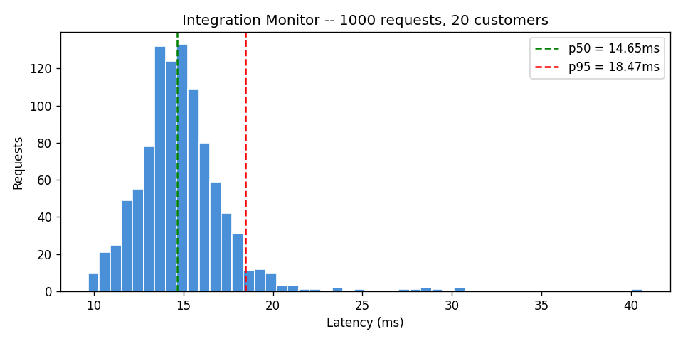

# Integration Onboarding Monitor

Schema gate API that validates integration payloads before they reach the database. 100% of malformed payloads rejected at the gate, with structured per-customer JSON logs.

## The Problem

Malformed integration payloads that reach the database cause cascading failures downstream -- bad data propagates through every system that reads from it. By the time someone notices, the root cause is buried under layers of dependent failures.

## How It Works

Every incoming payload is validated against a schema before any database write. Invalid payloads are rejected with a structured error response and logged per customer. The gate is the single enforcement point -- nothing bypasses it.

| Property | Guarantee |
|----------|-----------|
| Schema validation | 100% of malformed payloads rejected before DB write |
| Logging | Structured JSON per customer with customer_id |
| Throughput | 67.3 req/s sustained under 1,000-request benchmark |

## Invariants

| Test | What it proves |
|------|---------------|
| `test_malformed_rejected` | Invalid payloads never reach the database |
| `test_valid_accepted` | Well-formed payloads pass through without modification |
| `test_customer_isolation` | One customer's bad payload does not affect another's |
| `test_log_completeness` | Every rejection produces a log entry with customer_id |

15 tests passing.

## Benchmark

1,000 requests | 20 customers | **67.3 req/s** | **p50 = 14.654ms** | **p95 = 18.471ms**



## Run It

```bash
python -m venv .venv && source .venv/bin/activate
pip install -r requirements.txt

pytest tests/                      # 15 tests
python scripts/benchmark.py        # reports/results.json + reports/throughput.png
```

## Stack

Python, FastAPI, SQLite, pytest
